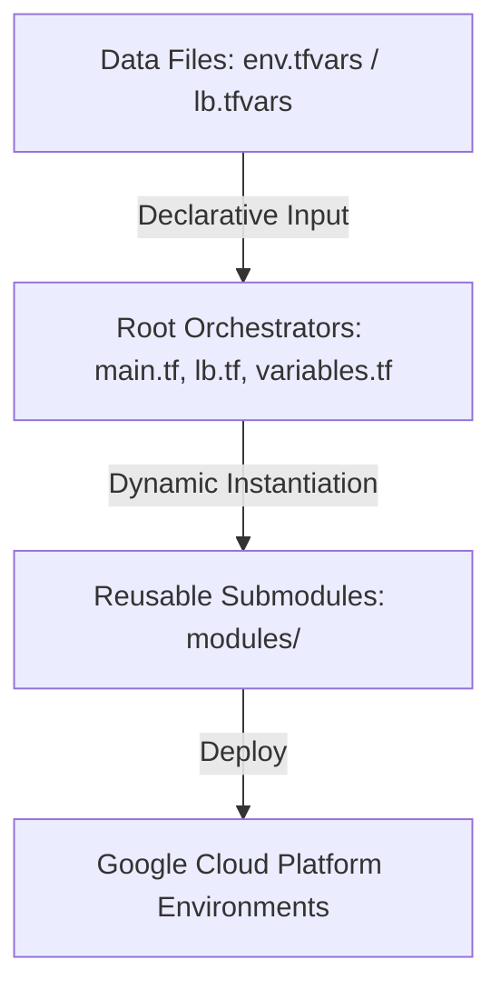

# GCP Terraform Modules Platform

Welcome to the **tf-goog-modules** repository. This platform serves as a highly modular, **Infrastructure as Data (IaD)** engine for deploying standardized and secure Google Cloud Platform (GCP) architectures.

By leveraging advanced HCL configurations and `for_each` schema loops, the entire platform can be provisioned dynamically. Infrastructure engineers can configure and deploy complex multi-region cloud networks, SQL databases, storage, firewall policies, and custom identity components entirely through data definitions (in `.tfvars` files) without writing or duplicating raw HCL blocks.

---

## 1. Platform Architecture & Paradigm

The repository separates **infrastructure orchestration** from **resource definition**:



1. **Environment Specs (`*.tfvars`)**: Declarative maps of nested configuration objects defining desired networks, subnets, load balancers, databases, service accounts, etc.
2. **Root Orchestration (`*.tf`)**: Consumes configuration maps and loops over them dynamically to instantiate child modules.
3. **Submodules (`modules/`)**: Standardized, individual GCP components (e.g., `vpc`, `cloud-sql-postgresql`, `cloud-run-v2`) wrapping best practices and security defaults.

---

## 2. Module Catalog

The repository contains 36 submodules inside the [modules/](file:///Users/devavratoka/Documents/tf-goog-modules/modules) directory:

* **Networking & Routing**: `vpc`, `subnetworks`, `cloud_router`, `cloud_nat`, `vpc_peering`, `static_routes`, `policy_based_routes`, `vlan-attachments`.
* **Load Balancing (LB)**: Located under `modules/lb/` (`region_health_check`, `region_backend_service`, `umig`, `neg`, `http_routing`, `forwarding_rule`).
* **Security & NGFW**: `ngfw_endpoint`, `ngfw_hfw`, `ngfw_nwfw`, `vpc_firewall`, `secure_tags`.
* **Databases & Storage**: `cloud-sql-mysql`, `cloud-sql-postgresql`, `cloud-sql-mssql`, `firestore`, `bigquery`, `gcs`.
* **Application & Compute**: `cloud-run-v2`, `ilbanh` (Internal Load Balancing Active Network Appliance Clusters).
* **Identity & Access Management (IAM)**: `iam-custom-role`, `iam-service-account`, `subnet_iam_binding`.
* **Connectivity**: `psa`, `pscendpoints`, `ncc_hub`, `ncc_spoke`, `network_attachments`, `addresses`, `global_addresses`, `dns`, `dns_policy`, `kms`.

---

## 3. Getting Started & Usage

### Prerequisites
* **Terraform CLI**: `v1.5.0` or later.
* **Google Provider & Google-Beta Provider**: Version `v7.28.0` or later (required to satisfy submodule constraints).
* **GCP Authentication**: Authenticate via application default credentials (ADC) or a service account key:
  ```bash
  gcloud auth application-default login
  ```

### Deployment Commands
1. Initialize the workspace, downloading providers and modules:
   ```bash
   terraform init
   ```
2. Preview planning changes using your specific environment configuration file:
   ```bash
   terraform plan -var-file="env.tfvars"
   ```
3. Deploy the infrastructure target:
   ```bash
   terraform apply -var-file="env.tfvars"
   ```

---

## 4. Repository Standards & Best Practices

When contributing or adding new submodules, adhere to the following codebase design patterns:

### 1. File Layout
Every reusable submodule must contain the following file structure:
```text
modules/new-component/
├── main.tf        # Resource declarations and HCL logic
├── variables.tf   # Inputs with types and default values
├── outputs.tf     # Resource outputs (id, self_link, name)
├── versions.tf    # Declared minimum Terraform and provider constraints
└── README.md      # Documentation explaining usage and schemas
```

### 2. Provider Specifications
* **Do not declare providers** inside reusable child modules. Providers must be inherited from the root orchestration.
* If a resource requires beta features, pass the `google-beta` provider dynamically using provider aliases or configuration blocks.

### 3. Variable Documentation
* Every input variable **must have a `description` block** describing its purpose and acceptable values.
* Utilize strict `type` declarations (avoid using the loose type `any` unless absolutely necessary).
* Always specify safe defaults (e.g., `default = null` or `default = {}`) for variables that are not strictly mandatory.

### 4. Formatting
Always format files recursively prior to submitting commits or PRs:
```bash
terraform fmt -recursive
```

---

## 5. Testing Submodules

Individual submodules in this repository support unit testing using the native **Terraform Test Framework** (`v1.6.0` or later). These tests utilize provider mocking to run fully locally, ensuring your variable validations and configuration logic are correct without deploying real infrastructure or requiring GCP credentials.

### Modules with Test Coverage:

The following submodules currently have unit test coverage:
* **Storage**: [gcs](file:///Users/devavratoka/Documents/tf-goog-modules/modules/gcs)
* **Connectivity & Routing**: [ncc_spoke](file:///Users/devavratoka/Documents/tf-goog-modules/modules/ncc_spoke), [pscendpoints](file:///Users/devavratoka/Documents/tf-goog-modules/modules/pscendpoints), [subnetworks](file:///Users/devavratoka/Documents/tf-goog-modules/modules/subnetworks), [vpc](file:///Users/devavratoka/Documents/tf-goog-modules/modules/vpc), [dns](file:///Users/devavratoka/Documents/tf-goog-modules/modules/dns)
* **Security & Firewall**: [ngfw_hfw](file:///Users/devavratoka/Documents/tf-goog-modules/modules/ngfw_hfw)
* **Load Balancing**: [lb/region_backend_service](file:///Users/devavratoka/Documents/tf-goog-modules/modules/lb/region_backend_service)
* **Databases**: [cloud-sql-postgresql](file:///Users/devavratoka/Documents/tf-goog-modules/modules/cloud-sql-postgresql)
* **Compute & Orchestration**: [cloud-run-v2](file:///Users/devavratoka/Documents/tf-goog-modules/modules/cloud-run-v2), [gkeautopilot](file:///Users/devavratoka/Documents/tf-goog-modules/modules/gkeautopilot)

### How to Run Submodule Tests:

1. **Navigate to the directory of the submodule you wish to test:**
   ```bash
   cd modules/gcs
   ```

2. **Initialize Terraform:**
   This downloads the mock provider schemas required to validate the configurations locally:
   ```bash
   terraform init
   ```

3. **Execute the test suite:**
   ```bash
   terraform test
   ```