# Module Dependency Graph & Architectural Layers

This document details the **Module Dependency Graph** for the **[tf-goog-modules](file:///Users/devavratoka/Documents/tf-goog-modules)** platform. 

Because this repository uses an **Infrastructure as Data (IaD)** model, dependencies are declared and chained at the **root orchestration level** (within **[main.tf](file:///Users/devavratoka/Documents/tf-goog-modules/main.tf)**, **[lb.tf](file:///Users/devavratoka/Documents/tf-goog-modules/lb.tf)**, and **[ilbanh.tf](file:///Users/devavratoka/Documents/tf-goog-modules/ilbanh.tf)**). These orchestration files feed output attributes (such as network IDs, subnet links, and health check names) from one submodule to another, creating a strict topological dependency flow.

---

## 1. Master Dependency Flow (Mermaid Diagram)

The following visual graph shows how submodules chain together. Arrow directions indicate that the target **requires** the source resource to be created first:

```mermaid
flowchart TD
    subgraph Base Networking [1. Core Networking]
        VPC[modules/vpc]
        Subnets[modules/subnetworks]
        StaticRoutes[modules/static_routes]
        PBR[modules/policy_based_routes]
        Peering[modules/vpc_peering]
        SharedVPC[modules/shared_vpc]
    end

    subgraph Core Connectivity [2. Connectivity & DNS]
        Router[modules/cloud_router]
        NAT[modules/cloud_nat]
        VlanAttach[modules/vlan-attachments]
        DNS[modules/dns]
        DNSPol[modules/dns_policy]
        Hub[modules/ncc_hub]
        Spoke[modules/ncc_spoke]
        SD[modules/service_directory]
    end

    subgraph Services PSA [3. Private Services Access]
        Address[modules/addresses]
        GlobAddress[modules/global_addresses]
        PSA[modules/psa]
        PSC[modules/pscendpoints]
        NetAttach[modules/network_attachments]
    end

    subgraph Firewall Security [4. NGFW & Security Tags]
        Tags[modules/secure_tags]
        Endpoint[modules/ngfw_endpoint]
        HFW[modules/ngfw_hfw]
        NWFW[modules/ngfw_nwfw]
        VPCFW[modules/vpc_firewall]
        SubnetIAM[modules/subnet_iam_binding]
    end

    subgraph Load Balancing [5. Region Load Balancers]
        HC[modules/lb/region_health_check]
        BES[modules/lb/region_backend_service]
        HTTP[modules/lb/http_routing]
        TCP[modules/lb/tcp_routing]
        FWD[modules/lb/forwarding_rule]
    end

    subgraph Identity Roles [6. IAM & Accounts]
        CRole[modules/iam-custom-role]
        SAccount[modules/iam-service-account]
    end

    %% 1. Base Networking Dependencies
    VPC -->|depends_on / network_self_link| Subnets
    VPC -->|depends_on / network_self_link| StaticRoutes
    VPC -->|depends_on / network_id| PBR
    VPC -->|depends_on| SharedVPC
    VPC -->|depends_on| Peering

    %% 2. Core Connectivity Dependencies
    VPC -->|depends_on / network_self_link| Router
    Router -->|depends_on| NAT
    Subnets -->|depends_on| NAT
    Router -->|depends_on / router_name| VlanAttach
    VPC -->|depends_on| DNS
    VPC -->|depends_on| DNSPol
    VPC -->|depends_on| Hub
    Hub -->|depends_on / hub_id| Spoke
    VPC -->|depends_on| Spoke
    VPC -->|depends_on / network_id| SD

    %% 3. PSA Dependencies
    VPC -->|network_self_link| Address
    Subnets -->|subnets_self_link| Address
    Subnets -->|depends_on| GlobAddress
    GlobAddress -->|global_address_name| PSA
    VPC -->|depends_on / network_name| PSA
    VPC -->|depends_on| PSC
    Subnets -->|depends_on / subnets_self_link| NetAttach

    %% 4. NGFW Security Dependencies
    VPC -->|depends_on| Endpoint
    Tags -->|depends_on| HFW
    Tags -->|depends_on| NWFW
    VPC -->|depends_on| VPCFW
    Subnets -->|depends_on / subnets_name| SubnetIAM

    %% 5. Load Balancing Dependencies
    HC -->|health_checks list| BES
    BES -->|depends_on / region_backend_service| HTTP
    BES -->|depends_on / region_backend_service| TCP
    BES -->|depends_on| FWD
    HTTP -->|depends_on / http_routing| FWD
    TCP -->|depends_on / tcp_routing| FWD

    %% 6. Identity Dependencies
    CRole -->|local.iam_custom_roles_ctx| SAccount
```

---

## 2. Layered Dependency Schema

Below is an exhaustive list of module dependency mappings defined across root orchestrators, along with the binding attribute:

### Layer 1: Core Networking (Orchestrated in `main.tf`)
| Module Name | Depends Directly On | Bound Output Attribute | Description |
| :--- | :--- | :--- | :--- |
| **[subnetworks](file:///Users/devavratoka/Documents/tf-goog-modules/modules/subnetworks)** | **[vpc](file:///Users/devavratoka/Documents/tf-goog-modules/modules/vpc)** | `module.networks[network_name].network_self_link` | Subnets require a VPC network self_link to bind to. |
| **[static_routes](file:///Users/devavratoka/Documents/tf-goog-modules/modules/static_routes)** | **[vpc](file:///Users/devavratoka/Documents/tf-goog-modules/modules/vpc)** | `module.networks[network_name].network_self_link` | Routes require a host VPC. |
| **[policy_based_routes](file:///Users/devavratoka/Documents/tf-goog-modules/modules/policy_based_routes)** | **[vpc](file:///Users/devavratoka/Documents/tf-goog-modules/modules/vpc)** | `module.networks[network_name].network_id` | Policy-based routes target a specific VPC ID. |
| **[vpc_peering](file:///Users/devavratoka/Documents/tf-goog-modules/modules/vpc_peering)** | **[vpc](file:///Users/devavratoka/Documents/tf-goog-modules/modules/vpc)** | `module.networks[network_name].network_self_link` | Peerings link two active VPC networks. |
| **[shared_vpc](file:///Users/devavratoka/Documents/tf-goog-modules/modules/shared_vpc)** | **[vpc](file:///Users/devavratoka/Documents/tf-goog-modules/modules/vpc)** | (Implicit dependency) | Shared VPC configuration runs against active host VPCs. |

### Layer 2: Connectivity & Routing (Orchestrated in `main.tf`)
| Module Name | Depends Directly On | Bound Output Attribute | Description |
| :--- | :--- | :--- | :--- |
| **[cloud_router](file:///Users/devavratoka/Documents/tf-goog-modules/modules/cloud_router)** | **[vpc](file:///Users/devavratoka/Documents/tf-goog-modules/modules/vpc)** | `module.networks[network_name].network_self_link` | Routers map to a specific VPC network. |
| **[cloud_nat](file:///Users/devavratoka/Documents/tf-goog-modules/modules/cloud_nat)** | **[cloud_router](file:///Users/devavratoka/Documents/tf-goog-modules/modules/cloud_router)** | `module.cloud_routers[router_name].router_name` | NAT gateways must be associated with an active Router name. |
| **[vlan-attachments](file:///Users/devavratoka/Documents/tf-goog-modules/modules/vlan-attachments)** | **[cloud_router](file:///Users/devavratoka/Documents/tf-goog-modules/modules/cloud_router)** | `module.cloud_routers[router_name].router_name` | Interconnect VLANs attach to a specific Router name. |
| **[ncc_spoke](file:///Users/devavratoka/Documents/tf-goog-modules/modules/ncc_spoke)** | **[ncc_hub](file:///Users/devavratoka/Documents/tf-goog-modules/modules/ncc_hub)** | `module.ncc_hub[hub_name].ncc_hub_id` | Network Connectivity Spokes must register with a central Hub ID. |
| **[service_directory](file:///Users/devavratoka/Documents/tf-goog-modules/modules/service_directory)** | **[vpc](file:///Users/devavratoka/Documents/tf-goog-modules/modules/vpc)** | `module.networks[network_name].network_id` | Service Directory endpoints link to internal VPC networks and forwarding rules for private naming. |

### Layer 3: Private Services Access (Orchestrated in `main.tf`)
| Module Name | Depends Directly On | Bound Output Attribute | Description |
| :--- | :--- | :--- | :--- |
| **[addresses](file:///Users/devavratoka/Documents/tf-goog-modules/modules/addresses)** | **[subnetworks](file:///Users/devavratoka/Documents/tf-goog-modules/modules/subnetworks)** | `module.subnetworks[subnetwork_name].subnets_self_link` | Addresses require a subnetwork self_link. |
| **[global_addresses](file:///Users/devavratoka/Documents/tf-goog-modules/modules/global_addresses)** | **[subnetworks](file:///Users/devavratoka/Documents/tf-goog-modules/modules/subnetworks)** | (Implicit `depends_on` block) | Service networking requires active subnet scopes. |
| **[psa](file:///Users/devavratoka/Documents/tf-goog-modules/modules/psa)** | **[global_addresses](file:///Users/devavratoka/Documents/tf-goog-modules/modules/global_addresses)** | `module.global_addresses[name].global_address_name` | Private Services Access requires pre-allocated IP ranges. |
| **[network_attachments](file:///Users/devavratoka/Documents/tf-goog-modules/modules/network_attachments)** | **[subnetworks](file:///Users/devavratoka/Documents/tf-goog-modules/modules/subnetworks)** | `module.subnetworks[name].subnets_self_link` | PSC Attachments reference subnetwork self_links. |

### Layer 4: Load Balancing (Orchestrated in `lb.tf`)
| Module Name | Depends Directly On | Bound Output Attribute | Description |
| :--- | :--- | :--- | :--- |
| **[region_backend_service](file:///Users/devavratoka/Documents/tf-goog-modules/modules/lb/region_backend_service)** | **[region_health_check](file:///Users/devavratoka/Documents/tf-goog-modules/modules/lb/region_health_check)** | `each.value.health_checks` (matching health check name) | Backend services depend on associated health checks. |
| **[http_routing](file:///Users/devavratoka/Documents/tf-goog-modules/modules/lb/http_routing)** | **[region_backend_service](file:///Users/devavratoka/Documents/tf-goog-modules/modules/lb/region_backend_service)** | (Implicit `depends_on` block) | HTTP target proxies route traffic to backend services. |
| **[tcp_routing](file:///Users/devavratoka/Documents/tf-goog-modules/modules/lb/tcp_routing)** | **[region_backend_service](file:///Users/devavratoka/Documents/tf-goog-modules/modules/lb/region_backend_service)** | (Implicit `depends_on` block) | TCP target proxies route traffic to backend services. |
| **[forwarding_rule](file:///Users/devavratoka/Documents/tf-goog-modules/modules/lb/forwarding_rule)** | **[http_routing](file:///Users/devavratoka/Documents/tf-goog-modules/modules/lb/http_routing)**, **[tcp_routing](file:///Users/devavratoka/Documents/tf-goog-modules/modules/lb/tcp_routing)** | (Implicit `depends_on` block) | Entrypoint IP forwarding rules direct traffic to target proxies. |

### Layer 5: Identity & Security (Orchestrated in `main.tf`)
| Module Name | Depends Directly On | Bound Output Attribute | Description |
| :--- | :--- | :--- | :--- |
| **[iam-service-account](file:///Users/devavratoka/Documents/tf-goog-modules/modules/iam-service-account)** | **[iam-custom-role](file:///Users/devavratoka/Documents/tf-goog-modules/modules/iam-custom-role)** | `local.iam_custom_roles_ctx` (for role names map) | Custom roles are auto-injected into service accounts context so they can be referenced directly in IAM bindings. |
| **[subnet_iam_binding](file:///Users/devavratoka/Documents/tf-goog-modules/modules/subnet_iam_binding)** | **[subnetworks](file:///Users/devavratoka/Documents/tf-goog-modules/modules/subnetworks)** | `module.subnetworks[subnetwork_name].subnets_name` | Subnet IAM bindings target an active subnetwork name. |
| **[ngfw_hfw](file:///Users/devavratoka/Documents/tf-goog-modules/modules/ngfw_hfw)** | **[secure_tags](file:///Users/devavratoka/Documents/tf-goog-modules/modules/secure_tags)** | (Implicit `depends_on` block) | Hierarchical firewalls target secure tags to secure resource boundaries. |
